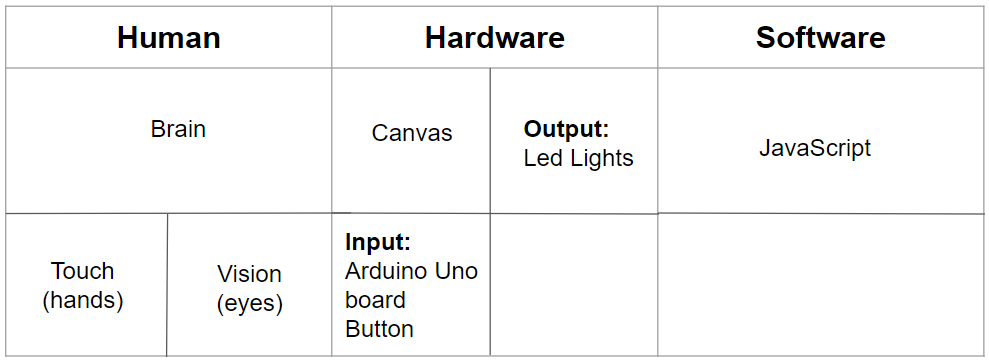

# Lesson: Interaction Design

## **First and Last Name** 

Μαρία Ιωάννα Κοτρότσιου
 

Χριστίνα Μαυροπούλου
 

Στέλλα Κορωναίου

 
## **University Registration Number** 

dpsd19057
 

dpsd19073

dpsd17058

 
## **GitHub Personal Profile** 

<a href="https://github.com/MarigiannaKotrotsiou"> Marigianna's Profile</a>

<a href="https://github.com/XristinaMavropoulou"> Xristina's Profile</a>

<a href="https://github.com/StellaKoronaiou17050"> Stella's Profile</a>

 
# Introduction

Στο πλαίσιο του μαθήματος της Διαδραστικής Σχεδίασης, για την ομαδική μας εργασία, ασχοληθήκαμε με το Interactive Art. Χρησιμοποίησαμε Arduino Board, όμως θα μπορούσαμε να είχαμε χρησιμοποιήσει και LilyPad, αλλά το Πανεπιστήμιο δεν μπορούσε να μας το παραχωρήσει και δεν είχαμε την οικονομική ικανότητα να αγοράσουμε δικό μας.

 
# Summary

Η ιδέα μας είναι να δημιουργήσουμε έναν “πίνακα” όπου μικρά παιδιά θα αλληλεπιδρούν μαζί του έτσι ώστε να “δημιουργήσουν” ένα νέο τοπίο, με σκοπό να γνωρίσουν και μία άλλη μορφή τέχνης, συνδυάζοντας την αφή και την όραση. Το αντικείμενο μας αποτελείται από ένα καμβά, ο οποίος είναι καλυμμένος με υφάσματα, και ένα push button που ανάβει πολλά led ταυτόχρονα.

# 1st Deliverable
 
## **1. Design Brief**

Δημιουργία ενός διαδραστικού "πίνακα", στον οποίο θα ανάβουν φωτάκια όταν ο χρήστης θα πατάει ένα push button, με σκοπό τη ψυχαγωγία του χρήστη και την γνωριμία του με άλλες μορφές τέχνης.

 
## 2. Research 
### 
i. Analyse People 

Το target group μας είναι παιδιά, σχολικής ηλικίας, από 6 χρονών και πάνω, με καλλιτεχνιές ανησυχίες.

Physical Differences: Αφού οι χρήστες μας είναι παίδια μικρών ηλικιών πρέπει το αντικείμενο μας να υπάρχει σε ένα ύψος που μπορεί να το φτάσει ένα παιδί, να είναι εύκολα κατανοητό και αλληλεπιδράσιμο, και οι διαπαφές να είναι συμβατές με τη σωματική διάπλαση ενός παιδιού.
 

Psychological Differences: Παιδιά με έντονες καλλιτεχνικές ανησυχίες και συναισθήματα περιέργιας και εξερεύνησης.

Social Differences: Προσιτό προς όλα τα παιδιά.

 
### 
ii. Define Activities 

 
Temporal: Όσες φορές θέλουν

 
Cooperation: Χρήστης-Πίνακας-Arduino-Φως

 
Complexity: -

 
Safety-Critical: -

 
The nature of content:

 
Οι χρήστες δεν χρειάζεται να κάνουν κάτι πριν χρησιμοποιήσουν/αλληλεπιδράσουν με το αντικείμενο. Το αντικείμενο θα υπάρχει σε ένα χώρο, και αν τραβήξει την προσοχή του χρήστη τότε εκείνος θα αλληλεπιδράσει μαζί του.

  
 ### 
iii. Describe Context

  
Physical: Το αντικείμενο θα βρίσκεται σε εσωτερικούς χώρους.

  
Social: -

  
Organisational:
 
   
Ιδιωτικοί εσωτερικοί χώροι: σπίτια, καφετέριες.
 
   
Εκπαιδευτικοί χώροι: δημόσια και ιδιωτικά σχολεία.
 
   
Δημόσιοι χώροι: μουσεία για παιδιά, μουσεία/γκαλέρι τέχνης

    
 ### 
iv. Review needed Technologies

 
Hardware: καμβάς, υφάσματα, κλοστές και βελόνες, κόλλα, χαρτόνια, Arduino board, breadboard, led lights, push button, καλόδια, resistor 220Ω και 1kΩ, υπολογιστής.
 

Software: JavaScript

 

Similar Projects/Inspo:<a href="https://handstories.typepad.com/?fbclid=IwAR3JaMVPNHasFTxXroTR3LkkRw5bZXqMC2ddlMvz21IbQtNuINpith6NHTI"> Handstories </a>, <a href="https://blog.arduino.cc/2014/02/03/an-interactive-musical-art-installation/?fbclid=IwAR2JWW1bzcagi3TylHOS8N-XM4UuSirMXygABErCrh8BCj3rXRku92rf0aY"> Interactive art </a>, <a href="https://idambrandao.wixsite.com/arduino/arte-interativa?fbclid=IwAR0RKlyoiGc2DWk6YigA0KXKoYp3jKSCbOBTg7czz7WkgK3SYpZGWA2OaYw"> Arduino Projects </a> 
 
 
# 2nd Deliverable
 
## 
3.Information architecture

## 
4.User Interaction 

Χρήστης-Πίνακας-Arduino-Φως

Ο χρήστης εντοπίζει το αντικείμενο στο χώρο που είναι τοποθετημένο. Το πλησιάζει και ακουμπάει το push button και ταυτόχρονα ανάβει ένα led σε συγκεκριμένο σημείο της εικονογράφίσης. Έτσι, ο χρήστης αλληλεπριδρά με το αντικείμενο και διαμορφώνει το σκηνικό που θέλει. 

# 3rd Deliverable 

## 
5. Scenarios & Storyboarding

 ### 
Design (user) Scenarios

 
 1.Ο Δημήτρης είναι 7 χρονών και από πάντα ήταν πολύ περίεργος. Ήθελε να εξερευνά τα πάντα και τον ενδιέφεραν γενικώς οι πιο εξελιγμένες συσκευές. Κάποια μέρα είχε πάει με τους γονείς του σε μία καφετέρια που είχε πολλά παιχνίδια για παιδιά και εκεί βρήκε το προϊόν μας. Του τράβηξε την προσοχή και ξεκίνησε να αλληλεπιδρά μαζί του. Τον εντυπωσίασε το τοπίο που ήταν φτιαγμένο από υφάσματα διαφόρων χρωμάτων, υφών και σχεδίων. Εντόπισε το κουμπί, και πατώντας το, άναψαν λαμπάκια στο τοπίο. Ενθουσιασμένος, συνέχισε να αλληλεπιδρά με το προϊόν μέχρι που ήρθε η ώρα να επιστρέψει σπίτι.

  
2.Η Πηνελόπη είναι 12 χρονών και της άσερει πολύ η τέχνη. Μια μέρα πήγαν εκδρομή με το σχολείο της σε ένα μουσείο τέχνης, όπου και εκεί βρήκε το προϊόν μας. Ήταν τοποθετημένο πάνω σε ένα τραπέζι με ένα σημείωμα μου ειδοποιούσε τους επισκέπτες ότι μπορούσαν να το χρησιμοποιήσουν. Το πλησίασε με περιέργεια, και αφού εντόπισε το κουμπί, το πάτησε, και ενθουσιάστηκε όταν είδε πως το τοπίο φωτίστηκε. Κατέληξε να αλληλεπιδρά μαζί του για αρκετή ώρα μέχρι που ήρθε η ώρα να φύγουν.

   
 ## 
6. Prototyping

Για να φτιάξουμε την μακέτα, ξεκινήσαμε με το να εξοικειωθούμε μαζί με το arduino και γι αυτό κάναμε έρευνα στο τι θα χρειαζόμασταν πάνω στο κομμάτι αυτό, καθώς και πάνω στο κομμάτι του κώδικα (όλες οι πηγές είναι στο Sources, μαζί με κάποια arduino projects που κάναμε).Aυτό είναι το project μας στο <a href="https://www.tinkercad.com/things/flMHsfHkztA-fantabulous-turing/editel">Tinkercad</a>

Αγοράσαμε δύο καμβάδες με διαφορετικά μεγέθη, 20x20 και 30x30, για να δούμε τι θα μας βολέψει παραπάνω, καθώς και να έχουμε ένα backup σε περίπτωση που γίνει κάτι. Επίσης, διαλέξαμε καμβάδες που έχουν κενό από πίσω έτσι ώστε να μπει εκεί το arduino. Ψάξαμε από φίλους μας αλλά και στο Πανεπιστήμιο, αφού ξέραμε ότι υπήρχαν διάφορα ρούχα από προηγούμενα μπαζάρ που είχαν γίνει, ρούχα και υφάσματα, με διαφορετικά χρώματα, σχέδια/patterns και υφές για να χρησιμοποιήσουμε για να καλύψουμε τον καμβά και να δημιουργήσουμε το τοπίο.

Αφού ράψαμε και κολλήσαμε όλα τα υφάσματα μαζί και δημιουργήσαμε το τοπίο μας, έπρεπε να συνδέσουμε το arduino. Το βάλαμε στην πίσω μεριά του καμβά σημαδέυσαμε εκεί που είναι τα ledακια και κάναμε μία τρύπα. Επίσης, χρειάστηκε να δούμε που είναι η υποδοχή του usb του arduino και χρειάστηκε επίσης να κόψουμε ένα κομμάτι ξύλου που υπάρχει στη περίμετρο του καμβά.

Αφού παίξαμε αρκετή ώρα με την τοποθέτηση του υφάσματος και του arduino πάνω στον καμβά, βρήκαμε μία σωστή θέση που ικανοποιούσε και εμάς και τις ανάγκες του arduinο και αποφασίσαμε να το κολλήσουμε έτσι. Πρώτα στερεοποιήσαμε το arduino στο πίσω μέρος του καμβά, μετά κολλήσαμε το ύφασμα στη μπροστινή μεριά, κρατώντας τεντομένη κάθε πλευρά του υφάσματος έτσι ώστε να κολλήθει όσο ίσια γινόταν. Τέλος, για έξτρα στήριξη του arduino, κολλήσαμε 2-3 χαρτόνια.

Για την ενεργοποίηση του πίνακα, αφού συνθέθει το usb του arduino συον υπολογιστή και τρέξει ο κώδικας, τα λαμπάκια θα ανάψουν απευθείας και όταν πατηθεί το κουμπί που βρίσκεται στην καμινάδα του σπιτιού του τοπίου, τα λαμπάκια θα σφήσουν.

# Conclusions

Κατά τη διάρκεια του εξαμήνου, καθώς δουλεύαμε πάνω στην ομαδική μας εργασία, μάθαμε τις διαφορετικές χρήσεις ενός νέου "εργαλείου" για εμάς, του arduino. Μάθαμε τι είναι το Interactive Art και ποιες μορφές μπορεί να πάρει. Δουλέψαμε με μία νέα γλώσσα, τη JavaScript και υλοποιήσαμε ένα project που μας άρεσε πολύ.

# Sources

<a href="https://www.arduino.cc/en/Tutorial/BuiltInExamples/Button">Button</a>

<a href="https://create.arduino.cc/projecthub/SBR/working-with-an-led-and-a-push-button-71d8c1">Push Button and Led</a>

<a href="https://roboticsbackend.com/arduino-turn-led-on-and-off-with-button/"> Turn LED ON and OFF With Button</a>

<a href="https://arduinogetstarted.com/faq/one-button-for-multiple-functions">One Button Multiple Functions</a>

Arduino Projects που κάναμε στο TinkerCad, προσπαθόντας να καταλάβουμε το Arduino UNO: <a href="https://www.tinkercad.com/things/6SANAukWtMI-cool-hango-elzing/editel">Arduino1</a> / <a href="https://www.tinkercad.com/things/bNeDqJtVItT-copy-of-first/editel">Arduino2</a> / <a href="https://www.tinkercad.com/things/kB9A8WHGCfd-copy-of-010422/editel">Arduino3</a> / <a href="https://www.tinkercad.com/things/d3l1IAmtYOi-hmanasas/editel">Arduino4</a> / <a href="https://www.tinkercad.com/things/33WjXwJZkQy-fantabulous-leelo-fyyran/editel">Arduino5</a> / <a href="https://www.tinkercad.com/things/h2IpW2ikov9-brave-tumelo-allis/editel">Arduino6</a>

