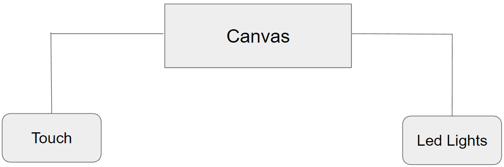

# Lesson: Interaction Design

## **First and Last Name** 

Μαρία Ιωάννα Κοτρότσιου
 

Χριστίνα Μαυροπούλου
 

Στέλλα Κορωναίου

 
## **University Registration Number** 

dpsd19057
 

dpsd19073

dpsd17058

 
## **GitHub Personal Profile** 

<a href="https://github.com/MarigiannaKotrotsiou"> Marigianna's Profile</a>

<a href="https://github.com/XristinaMavropoulou"> Xristina's Profile</a>

<a href="https://github.com/StellaKoronaiou17050"> Stella's Profile</a>

 
# Introduction

# Summary

# 1st Deliverable
 
## **1. Design Brief**

Δημιουργία ενός διαδραστικού "πίνακα", ο οποίος θα παράγει αλλαγές φωτισμού όταν ο χρήστης θα αλληλεπιδρά μαζί του μέσω αφής, με σκοπό τη ψυχαγωγία του χρήστη.

 
## 2. Research 
### 
i. Analyse People 

Το target group μας είναι παιδιά, σχολικής ηλικίας, από 6 χρονών και πάνω, με καλλιτεχνιές ανησυχίες.

Physical Differences: Αφού οι χρήστες μας είναι παίδια μικρών ηλικιών πρέπει το αντικείμενο μας να υπάρχει σε ένα ύψος που μπορεί να το φτάσει ένα παιδί, να είναι εύκολα κατανοητό και αλληλεπιδράσιμο, και οι διαπαφές να είναι συμβατές με τη σωματική διάπλαση ενός παιδιού.
 

Psychological Differences: Παιδιά με έντονες καλλιτεχνικές ανησυχίες και συναισθήματα περιέργιας και εξερεύνησης.

Social Differences: Προσιτό προς όλα τα παιδιά.

 
### 
ii. Define Activities 

 
Temporal: Όσες φορές θέλουν

 
Cooperation: Χρήστης-Πίνακας-Arduino-Φως

 
Complexity: -

 
Safety-Critical: -

 
The nature of content:

 
Οι χρήστες δεν χρειάζεται να κάνουν κάτι πριν χρησιμοποιήσουν/αλληλεπιδράσουν με το αντικείμενο. Το αντικείμενο θα υπάρχει σε ένα χώρο, και αν τραβήξει την προσοχή του χρήστη τότε εκείνος θα αλληλεπιδράσει μαζί του.

  
 ### 
iii. Describe Context

  
Physical: Το αντικείμενο θα βρίσκεται σε εσωτερικούς χώρους.

  
Social: -

  
Organisational:
 
   
Ιδιωτικοί εσωτερικοί χώροι: σπίτια, καφετέριες.
 
   
Εκπαιδευτικοί χώροι: δημόσια και ιδιωτικά σχολεία.
 
   
Δημόσιοι χώροι: μουσεία για παιδιά, μουσεία/γκαλέρι τέχνης

    
 ### 
iv. Review needed Technologies

 
Hardware: καμβάς, υφάσματα, κλοστές και βελόνες, κόλλα, Arduino board, breadboard, led lights, push button, καλόδια, resistor 220Ω και 1kΩ, υπολογιστής.
 

Software: JavaScript

 

Similar Projects/Inspo:<a href="https://handstories.typepad.com/?fbclid=IwAR3JaMVPNHasFTxXroTR3LkkRw5bZXqMC2ddlMvz21IbQtNuINpith6NHTI"> Handstories </a>, <a href="https://blog.arduino.cc/2014/02/03/an-interactive-musical-art-installation/?fbclid=IwAR2JWW1bzcagi3TylHOS8N-XM4UuSirMXygABErCrh8BCj3rXRku92rf0aY"> Interactive art </a>, <a href="https://idambrandao.wixsite.com/arduino/arte-interativa?fbclid=IwAR0RKlyoiGc2DWk6YigA0KXKoYp3jKSCbOBTg7czz7WkgK3SYpZGWA2OaYw"> Arduino Projects </a> 
 
 
# 2nd Deliverable
 
## 
3.Information architecture

## 
4.User Interaction 

 

Χρήστης-Πίνακας-Arduino-Φως

Ο χρήστης εντοπίζει το αντικείμενο στο χώρο που είναι τοποθετημένο. Το πλησιάζει και ακουμπάει το push button και ταυτόχρονα ανάβει ένα led σε συγκεκριμένο σημείο της εικονογράφίσης. Έτσι, ο χρήστης αλληλεπριδρά με το αντικείμενο και διαμορφώνει το σκηνικό που θέλει. 

# 3rd Deliverable 

## 
5. Scenarios & Storyboarding

 ### 
Design (user) Scenarios

 
 1.Ο Δημήτρης είναι 7 χρονών και από πάντα ήταν πολύ περίεργος. Ήθελε να εξερευνά τα πάντα και τον ενδιέφεραν γενικώς οι πιο εξελιγμένες συσκευές. Κάποια μέρα είχε πάει με τους γονείς του σε μία καφετέρια που είχε πολλά παιχνίδια για παιδιά και εκεί βρήκε το προϊόν μας. Του τράβηξε την προσοχή και ξεκίνησε να αλληλεπιδρά μαζί του. Τον εντυπωσίασε το τοπίο που ήταν φτιαγμένο από υφάσματα διαφόρων χρωμάτων, υφών και σχεδίων. Εντόπισε το κουμπί, και πατώντας το, άναψαν λαμπάκια στο τοπίο. Ενθουσιασμένος, συνέχισε να αλληλεπιδρά με το προϊόν μέχρι που ήρθε η ώρα να επιστρέψει σπίτι.

  
2.Η Πηνελόπη είναι 12 χρονών και της αρέσει να κατασκευάζει αντικείμενα και να κάνει πειράματα, βασισμένα στο μάθημα της Φυσικής του σχολείου της. Μια μέρα πήγαν εκδρομή με το σχολείο  σε ένα μουσείο φυσικής όπου και εκεί βρήκε το προϊόν μας. Το πλησίασε με περιέργεια, και αφού εντόπισε το κουμπί, το πάτησε, και ενθουσιάστηκε όταν είδε πως το τοπίο φωτίστηκε. Κατέληξε να αλληλεπιδρά μαζί του για αρκετή ώρα και εν τέλη ρώτησε κάποιον υπεύθυνο πως είναι φτιαγμένο για να προσπαθήσει να φτιάξει και εκείνη το δικό της.

  

# Conclusions

# Sources
